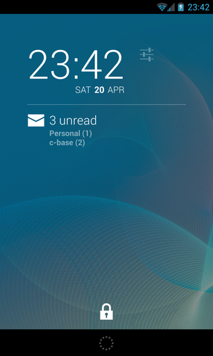
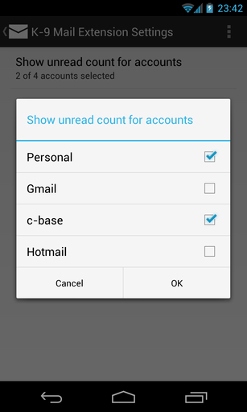

# K-9 Mail DashClock Extension

This is an extension for the popular DashClock Widget to display the number of unread messages in K-9 Mail, the email app with the robot dog.

To use this extension you need to have the following apps installed:

* [DashClock Widget](https://play.google.com/store/apps/details?id=net.nurik.roman.dashclock)
* [K-9 Mail](https://play.google.com/store/apps/details?id=com.fsck.k9)

## Changelog

### Version 1.4
* Added French and Russian translation

### Version 1.3
* Improved error handling
* Stop hiding unnamed accounts
* Added Italian translation

### Version 1.2
* Added Slovak translation
* Fixed a bug that crashed the extension when K-9 Mail handed out an empty account name

### Version 1.1
* Added German translation
* Fixed a small bug

### Version 1.0
* Initial release

## Contribute

### Code
Please base your pull requests on the [dev](https://github.com/cketti/DashClock_K-9/tree/dev) branch.

### Translations
For translations please visit the [DashClock_K-9 project on Transifex](https://www.transifex.com/projects/p/dashclock_k-9/).

## Contributors
* [See here](https://github.com/cketti/DashClock_K-9/graphs/contributors)

## License

    Copyright (C) 2013-2014 Christian Ketterer (cketti)

    Licensed under the Apache License, Version 2.0 (the "License");
    you may not use this file except in compliance with the License.
    You may obtain a copy of the License at

       http://www.apache.org/licenses/LICENSE-2.0

    Unless required by applicable law or agreed to in writing, software
    distributed under the License is distributed on an "AS IS" BASIS,
    WITHOUT WARRANTIES OR CONDITIONS OF ANY KIND, either express or implied.
    See the License for the specific language governing permissions and
    limitations under the License.
